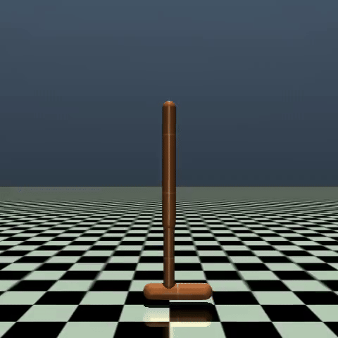

# Hopper-Reinforce + Actor-Critic

REINFORCE and Actor-Critic implementations for the Hopper-v5 MuJoCo environment using PyTorch.



## Setup

```bash
uv sync
```

## Usage

```bash
# REINFORCE
uv run python Hopper-Reinforce/main.py

# Actor-Critic
uv run python Hopper-Actor-Critic/main.py
```

## Experimental Results

We compared three policy gradient methods on the `Hopper-v5` environment:
- **Actor-Critic**: Achieves the highest average reward and reaches lower policy entropy, indicating a faster transition toward a more deterministic and stable locomotion policy.
- **REINFORCE with Baseline**: Using the batch average return as a baseline reduces variance, significantly improving training stability and final performance.
- **REINFORCE (Vanilla)**: The weakest performer due to the high variance of Monte Carlo gradient estimates.

